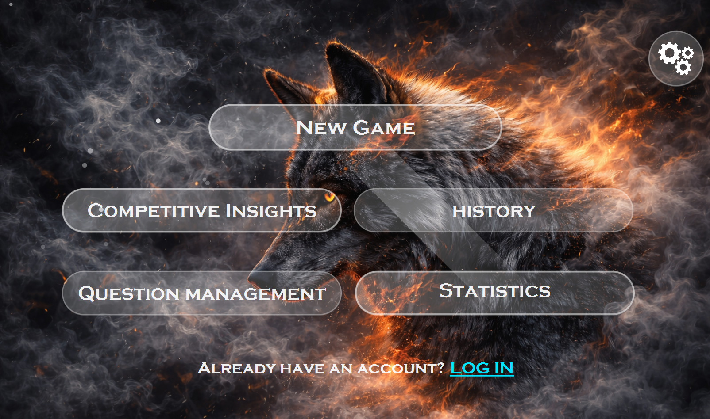
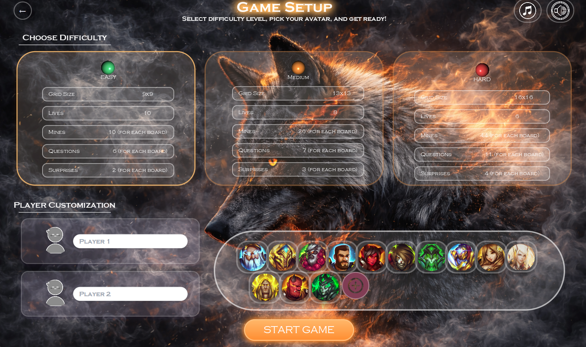
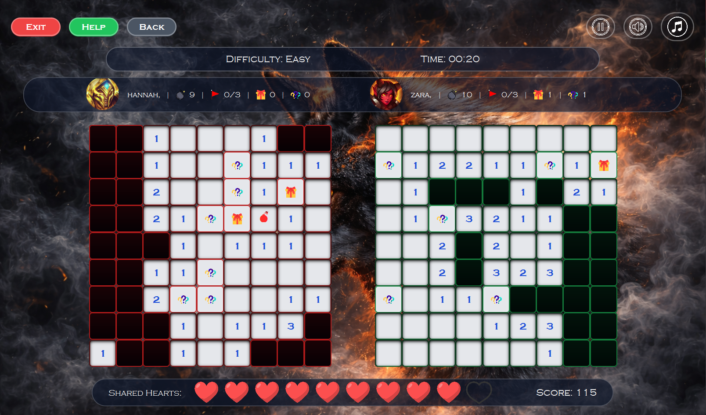
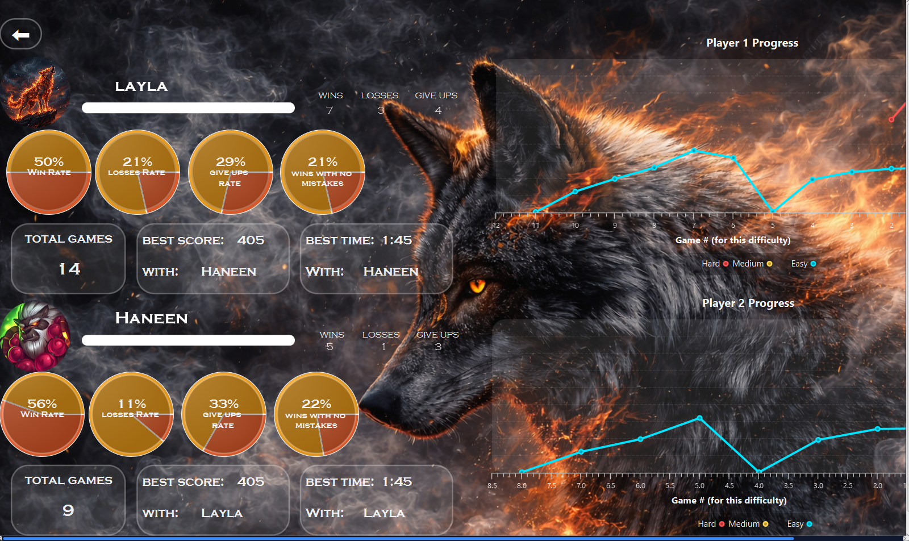
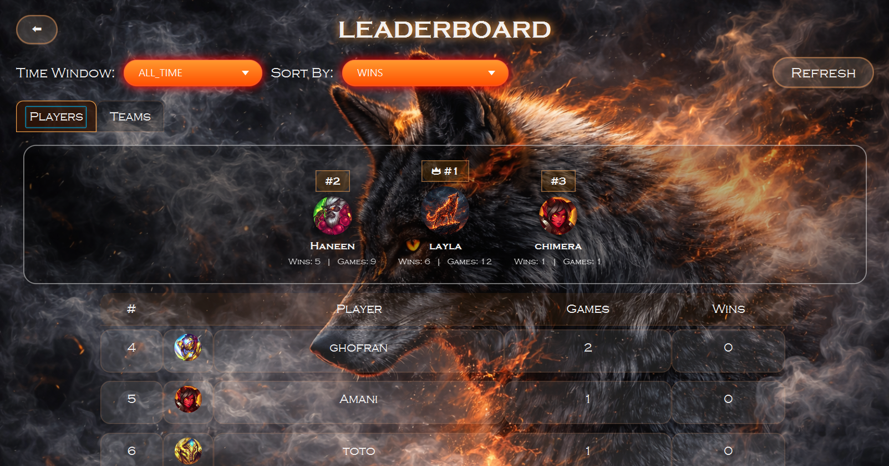
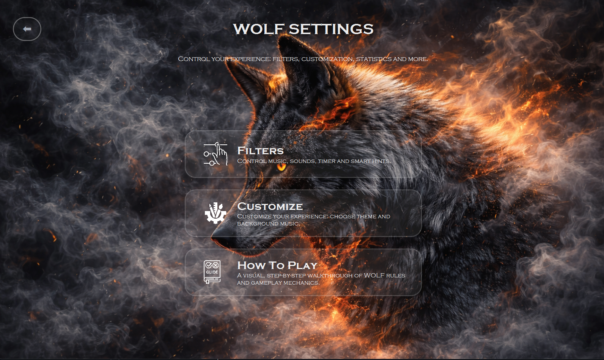
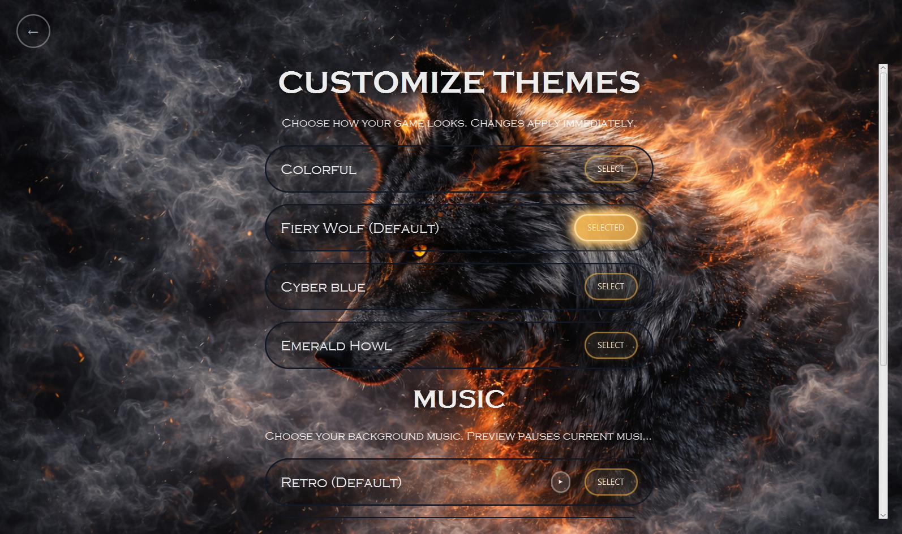

#  Wolf Minesweeper

A modern competitive multiplayer Minesweeper-inspired game featuring dynamic gameplay systems, player customization, advanced statistics, leaderboards, themes, music control, and strategic power-ups.

Designed as a complete desktop game experience with a cinematic fantasy-inspired UI and multiple gameplay systems beyond traditional Minesweeper.

---

#  Features

##  Competitive Multiplayer Gameplay
- Two-player real-time competitive gameplay
- Independent game boards for each player
- Shared hearts/lives system
- Score tracking and timed matches
- Multiple difficulty levels

##  Advanced Minesweeper Mechanics
- Classic mine detection gameplay
- Randomized surprise cells
- Question-based challenge cells
- Dynamic scoring system
- Multiple board sizes and mine distributions

##  Statistics & Progress Tracking
- Win/loss tracking
- Performance analytics
- Best score and best time records
- Match history
- Player progression graphs
- Difficulty-based statistics

##  Leaderboards
- Global ranking system
- Sorting by wins/games
- Player and team rankings
- Time window filtering
- Dynamic leaderboard updates

##  Customization System
- Multiple visual themes
- Background music selection
- UI personalization
- Avatar selection
- Player profile customization

##  Settings & Accessibility
- Sound/music controls
- Smart hint systems
- Timer controls
- Gameplay filters
- Interactive help system

---

#  Screenshots

## Main Menu

---

## Game Setup

---

## Gameplay

---

## Statistics Dashboard

---

## Leaderboard System

---

## Settings

---

## Theme Customization

---

## How to Run

### Requirements
- Java JDK 19
- Maven
- JavaFX dependencies configured through Maven

### Run with Eclipse
1. Clone or download the repository.
2. Open Eclipse.
3. Import the project as an existing Maven project.
4. Make sure the project uses JDK 19.
5. Wait for Maven to download the required dependencies.
6. Run `control.Main`.
   
---

#  Technologies Used

- Java
- JavaFX
- Object-Oriented Programming (OOP)
- File/Data Management
- Custom UI Design
- Event-Driven Programming
- Game State Management
- Data Visualization & Statistics

---

#  Software Engineering Concepts

This project was built with emphasis on:

- Object-Oriented Design
- Modular Architecture
- State Management
- UI/UX Design
- Data Persistence
- Scalability & Maintainability
- Game Logic Abstraction

---

#  Possible Future Improvements

- Online multiplayer support
- AI opponent system
- Achievement system
- Cloud leaderboard integration
- Additional game modes
- Mobile adaptation
- Animation improvements

---

#  Project Highlights

This project extends the traditional Minesweeper concept into a full competitive game platform by combining:

- Multiplayer strategy
- Statistics & analytics
- Customization systems
- Dynamic gameplay mechanics
- Modern game-oriented UI design

The goal was to create a polished and feature-rich desktop game experience rather than a simple Minesweeper clone.
